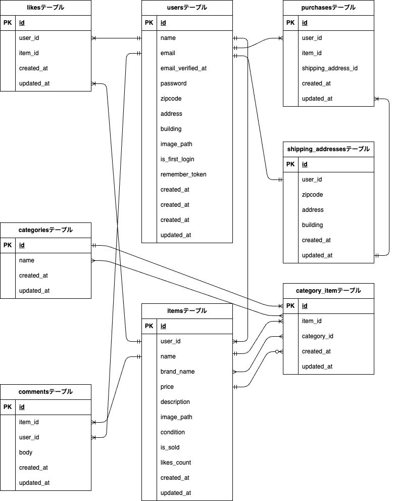

# freemarket-test

## 使用技術

- PHP 8.2.11  
- Laravel 8.83.29  
- MySQL 8.0.26  
- Nginx 1.21.1  
- phpMyAdmin（phpmyadmin/phpmyadmin 最新）  
- Mailtrap（メール認証用）  
- Stripe 
- Docker, Docker Compose

## 環境構築

1. リポジトリをクローン
   ```bash
   git clone git@github.com:su-masayuki/freemarket-test.git
   cd freemarket-test
   ```

2. Docker コンテナを起動
   ```bash
   docker-compose up -d --build
   ```

3. Laravel アプリケーションのセットアップ
   ```bash
   docker-compose exec php bash
   composer install
   cp .env.example .env
   mkdir -p ./src/storage/app/public/images/items ./src/storage/app/public/images/profiles
   php artisan key:generate
   php artisan migrate
   php artisan db:seed
   ```

4. ストレージリンクの作成
   ```bash
   php artisan storage:link
   ```

5. Stripe Webhookのテスト設定
   ```bash
   stripe listen --forward-to localhost/api/webhook/stripe
   ```

6. Mailtrapの設定を`.env`に追加
## 主な機能

- 会員登録・ログイン（メール認証あり）
- 商品一覧・詳細の閲覧
- 商品の検索
- 商品の出品・編集
- 商品の購入
- コメント機能
- いいね機能
- プロフィール確認・編集

## 重要なコマンド

- コンテナ起動: `docker-compose up -d`
- コンテナ停止: `docker-compose down`
- Laravelサーバ起動: `php artisan serve`
- マイグレーション: `php artisan migrate`
- シーディング: `php artisan db:seed`

## メール認証
mailtrapを使用しています。<br>
以下のリンクから会員登録をしてください。　<br>
https://mailtrap.io/

メールボックスのIntegrationsから 「laravel 7.x and 8.x」を選択し、　<br>
.envファイルのMAIL_MAILERからMAIL_ENCRYPTIONまでの項目をコピー・ペーストしてください。　<br>
MAIL_FROM_ADDRESSは任意のメールアドレスを入力してください。　

## Stripeについて
コンビニ支払いとカード支払いのオプションがありますが、決済画面にてコンビニ支払いを選択しますと、レシートを印刷する画面に遷移します。そのため、カード支払いを成功させた場合に意図する画面遷移が行える想定です。<br>

また、StripeのAPIキーは以下のように設定をお願いいたします。
```
STRIPE_PUBLIC_KEY="パブリックキー"
STRIPE_SECRET_KEY="シークレットキー"
STRIPE_WEBHOOK_SECRET="WEBHOOKシークレットキー"
```

以下のリンクは公式ドキュメントです。<br>
https://docs.stripe.com/payments/checkout?locale=ja-JP

## URL

- 商品一覧: http://localhost
- 会員登録: http://localhost/register
- ログイン: http://localhost/login
- phpMyAdmin: http://localhost:8080

## デモログイン情報（開発用）

初期シーディングでテストユーザーが1人登録されますが、メールアドレスはランダム生成（例: `taro64ffb19f4b8b7@example.com`）となるため、ログイン確認にはデータベースから直接確認してください。

パスワードは共通で `password` に設定されています。

## テスト実行方法

以下のコマンドで PHPUnit テストを実行できます：

```sh
php artisan test

## ER図


